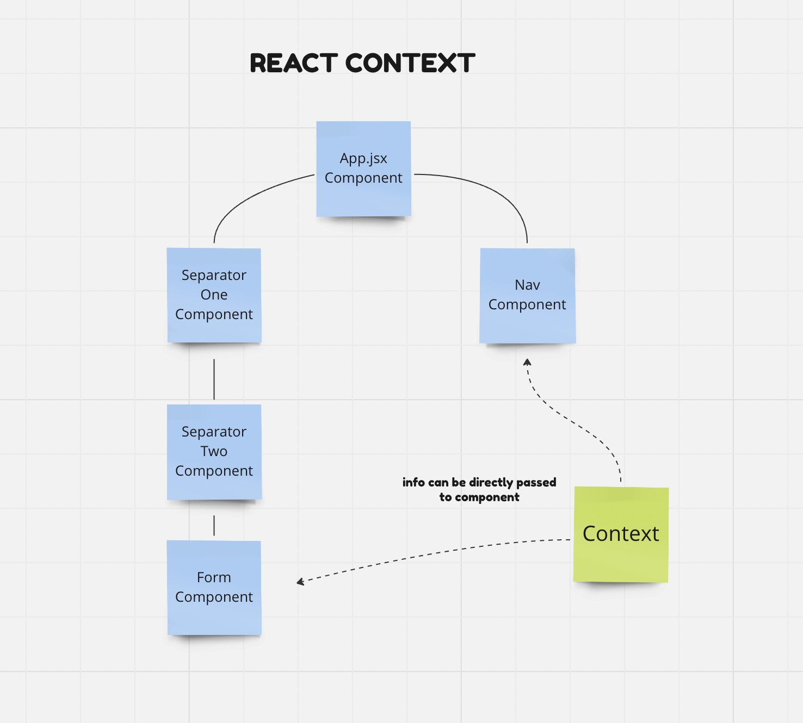

# React Context

## Application Component Tree

This application uses React Context to change the language of a nested Form Component and a non-nested Nav Component from english to french and vice versa.

The code in this repo has many comments.  
Use the comments as well as the videos to increase your understanding of React Context.

## Videos

- [React Context Intro](https://drive.google.com/file/d/1qOfSkNPeNEeEqs8lZAiMukSfhITKUGlR/view?usp=sharing) - high level explanation of React Context
- [React Context Setup](https://drive.google.com/file/d/1yY7i-KhnU2jw7x-RKyXuv9GCB1KabiEt/view?usp=sharing) - create your context folder and wrapper component
- [React Context Hookup](https://drive.google.com/file/d/1nfcVSlI1BJBSwSQmdxyNXgWII_Ag1l6j/view?usp=sharing) - - connect React Context to your application
- [React Context - Create Custom Hook](https://drive.google.com/file/d/1JJF0LUlmOUsOlm6IrTXd6ZhcQqSsO91A/view?usp=sharing) - create a custom hook that will be used in your components to consume (a.k.a use the data from) the data from context
- [React Context - Navbar](https://drive.google.com/file/d/1NG5jgwde-0NaJXfa4M3WBZS9hqn5VR3m/view?usp=sharing) - consume (a.k.a use the data from) React Context in your Navbar
- [React Context - Form part 1](https://drive.google.com/file/d/1ZJ8SUgz6cvDVTOJUMMy9zZm0fBGlT2NG/view?usp=sharing) - walkthrough of the form code and consume the date from React Context in your form
- [React Context Fort part 2 - event listeners](https://drive.google.com/file/d/1AwBSrqZxhixaA9FKB54uHBTvVf5ZaR0R/view?usp=sharing) - connect event listeners in the form
- [React Context - useEffect & fetch](https://drive.google.com/file/d/1AO-ZS853LeLpxwwqPR7abVonK89XWIis/view?usp=sharing) - fetch data from the server to store in the state located in React Context

### Steps to Create Context:

1. Create a `context` directory and a file for the context, custom hook etc.
1. Create the context using `createContext` from `react`
1. Create a custom wrapper Provider component using the .Provider method on the created context where you will house your data, state, functions whatever you choose to allow to be consumed
1. Wrap your whole application `<App />` using the wrapper Provider component
1. Create a custom hook for the consumer using `useContext` and the name of the context you created
1. Use your custom hook to consume the data in whichever component you choose.

Good Luck!
